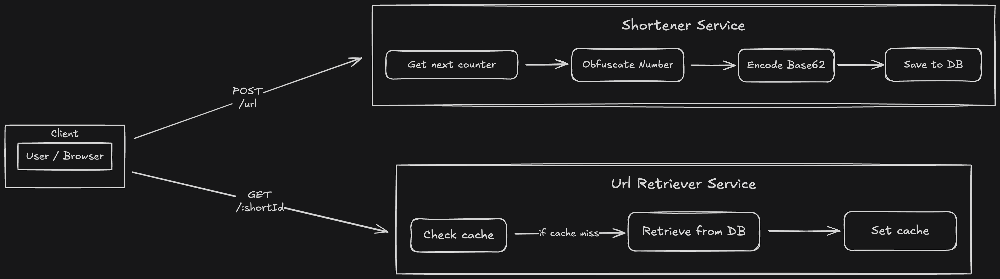

# 🔗 URL Shortener

> **Production-ready URL shortening service similar to Bitly or TinyURL**



## Key Components

### Shortening

- **URL Shortening Service**  
  [`src/url/commands/shorten-url/service.ts`](src/url/commands/shorten-url/service.ts)

- **Counter Service(s)**
  - [`redis-counter.service.ts`](src/counter/implementations/redis/redis-counter.service.ts)
  - [`redis-batch-counter.service.ts`](src/counter/implementations/redis/redis-batch-counter.service.ts)
  - [`postgres-counter.service.ts`](src/counter/implementations/postgres/postgres-counter.service.ts)
  - [`postgres-batch-counter.service.ts`](src/counter/implementations/postgres/postgres-batch-counter.service.ts)

- **ID Obfuscation Service**  
  [`src/url/app-services/id-obfuscator.service.ts`](src/url/app-services/id-obfuscator.service.ts)

- **Number Hashing Service**  
  [`src/url/app-services/number-hasher.service.ts`](src/url/app-services/number-hasher.service.ts)

- **URL Repository**  
  [`src/url/repositories/url.repository.ts`](src/url/repositories/url.repository.ts)

### Retrieval

- **URL Retrieval Service**  
  [`src/url/queries/get-real-url/service.ts`](src/url/queries/get-real-url/service.ts)

[](https://www.typescriptlang.org/)
[](https://nestjs.com/)
[](https://www.postgresql.org/)
[](https://redis.io/)
[](https://www.docker.com/)

## ✨ **Features**

### **Core Functionality**

- ✅ **Custom URL Generation** - Base62 encoding with collision handling
- ✅ **Non-Predictable Short URLs** – Uses a bijection function with a counter to generate non-sequential short URLs
- ✅ **High-Performance Redirects** - Redis-cached lookups
- ✅ **API Documentation** - Complete Swagger/OpenAPI documentation
- ✅ **Comprehensive Error Handling** - Graceful error responses
- ✅ **Docker Deployment** - Production-ready containerization

## 🛠️ **Tech Stack**

### **Backend**

- **Framework**: [NestJS](https://nestjs.com/) - Progressive Node.js framework
- **Language**: [TypeScript](https://www.typescriptlang.org/)

### **Data Layer**

- **Primary Database**: [PostgreSQL](https://www.postgresql.org/) - Reliable ACID compliance
- **ORM**: [Prisma](https://www.prisma.io/) - Next-generation ORM
- **Caching**: [Redis](https://redis.io/) - High-performance in-memory cache

### **Development & DevOps**

- **Package Manager**: [pnpm](https://pnpm.io/) - Fast, efficient package management
- **Containerization**: [Docker](https://www.docker.com/) - Consistent deployment
- **Testing**: [Jest](https://jestjs.io/) - Comprehensive test suite
- **Logging**: [Pino](https://getpino.io/) - High-performance logging

## 📦 **Installation & Setup**

### **Prerequisites**

- Node.js 22+
- Docker & Docker Compose
- pnpm

### **Quick Start**

```bash
# 1. Clone the repository (Needed only 1st time)
git clone https://github.com/CSenshi/system-craft.git
cd system-craft

# 2. Install dependencies (Needed only 1st time)
pnpm install

# 3. Copy env file (Needed only 1st time)
cp apps/url-shortener/.env.example apps/url-shortener/.env

# 4. Start required services (Needed only 1st time)
pnpm nx run @apps/url-shortener:infra:up

# 5. Run database migrations (Needed only 1st time)
pnpm nx run @apps/url-shortener:prisma-deploy

# 6. Start the development server
pnpm nx run @apps/url-shortener:serve
```

## 🔧 **API Usage**

### **Shorten a URL**

```bash
curl -X POST http://localhost:3000/url \
  -H "Content-Type: application/json" \
  -d '{
    "url": "https://www.google.com"
  }'

# Response
{
  "shortUrl": "http://localhost:3000/l/abc123"
}
```

### **Redirect to Original URL**

> **Note:** Use the `shortUrl` value returned from the previous command in place of the example `abc123` in the following steps.

```bash
curl -L http://localhost:3000/l/abc123
```

## 🧪 **Testing**

### **Run Tests**

```bash
# Unit tests
pnpm nx test @apps/url-shortener

# Integration tests
pnpm nx test:int @apps/url-shortener

# E2E tests
pnpm nx e2e @e2e/url-shortener
```
