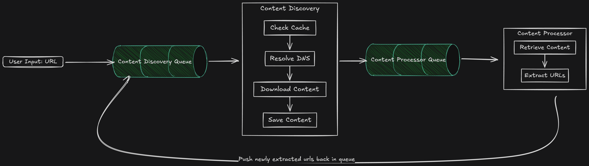

# 🕷️ Web Crawler

> **Distributed, scalable web crawler for automated content discovery and extraction**



[](https://www.typescriptlang.org/)
[](https://nestjs.com/)
[](https://aws.amazon.com/s3/)
[](https://aws.amazon.com/dynamodb/)
[](https://www.docker.com/)


## ✨ **Features**

- ✅ **Distributed Crawling** – Queue-based, scalable URL discovery and processing
- ✅ **Recursive Content Extraction** – Finds and queues new URLs from downloaded content
- ✅ **Cloud-Native Storage** – Uses S3 for content, DynamoDB for crawl metadata
- ✅ **DNS Resolution & Download** – Robust Round Robin DNS resolving
- ✅ **Modular, Testable Design** – Built with NestJS and TypeScript
- ✅ **Dockerized** – Easy to deploy and run anywhere

## 🛠️ **Tech Stack**

### **Backend**
- **Framework**: [NestJS](https://nestjs.com/)
- **Language**: [TypeScript](https://www.typescriptlang.org/)

### **Data Layer & Cloud**
- **Content Storage**: [AWS S3](https://aws.amazon.com/s3/)
- **Metadata**: [AWS DynamoDB](https://aws.amazon.com/dynamodb/)
- **Queue**: [AWS SQS](https://aws.amazon.com/sqs/)

## 📦 **Installation & Setup**

### **Prerequisites**
- Node.js 22+
- Docker & Docker Compose
- pnpm

### **Quick Start**
```bash
# 1. Clone the repository (Needed only 1st time)
git clone https://github.com/CSenshi/system-craft.git
cd system-craft

# 2. Install dependencies (Needed only 1st time)
pnpm install

# 3. Copy env file (Needed only 1st time)
cp apps/web-crawler/.env.example apps/web-crawler/.env

# 4. Start required services (Needed only 1st time)
pnpm nx run @apps/web-crawler:infra:up

# 5. Start the development server
pnpm nx run @apps/web-crawler:serve
```

## 🔧 **Usage**

The crawler works by pushing URLs to the Content Discovery Queue. The system will recursively crawl and process content, extracting new URLs and re-queuing them for further discovery.

### **Send a Test Message to the Queue**

You can use the provided script to send a test message (URL) to the queue:

```bash
nx run @apps/web-crawler:sqs:test-message
```

This will enqueue a sample URL for crawling and trigger the full discovery and processing flow.

## 🧪 **Testing**

### **Run Tests**
```bash
# Unit tests
pnpm nx test @apps/web-crawler

# Integration tests
pnpm nx test:int @apps/web-crawler

# E2E tests
pnpm nx e2e @e2e/web-crawler
```